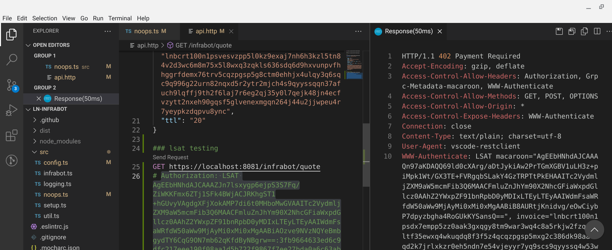
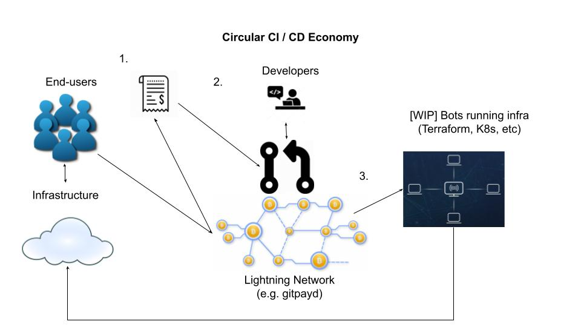

# ln-infrabot

infrabot accepts payments via LSATS to deploy and maintain infrastructure so you don't have to

become part of a global decentralized IaaS network by leveraging micro-payments and existing resources



```bash
[INFO]  2021-06-18T18:00:24.097Z => warning: infrabot development server is running
[ERROR] 2021-06-18T18:00:24.104Z => https is not configured, check ssl certs location or passphrase
[INFO]  2021-06-18T18:00:24.111Z => gitpayd un-secure started in 3ms on penguin:3637
[DEBUG] 2021-06-18T18:00:24.121Z => rpc proto path is /home/nigellchristian/lnd/lnrpc/rpc.proto
[DEBUG] 2021-06-18T18:00:24.292Z => found lnd 0.12.1-beta 
[INFO]  2021-06-18T18:00:30.803Z => 127.0.0.1 connected to infrabot/noops
[DEBUG] 2021-06-18T18:00:30.809Z => Request: {"app":"node.js","isNew":true,"repo":"https://github.com/reemuru/headerParse.git","cwd":"headerParse","install":{"cmd":"npm","args":["i"]},"tti":30,"compile":null,"run":{"cmd":"node","args":["index.js"]},"payment_request":"lnbcrt100n1psvesvzpp5l0kz9exaj7nh6h3kzl5tn84v2d3wc6m8m75x5l8wxq3zqkls636sdq6d9hxvunpvfhhggrfdemx76trv5cqzpgsp5g8ctm0ehhjx4ulqy3q6sqc9q996g22urn82nqxd5r2ytr2mjch4s9qyyssqqn37afuch9lqffj9th2f6laj7r6eg2qj35y0l7qejk48jn4ecfvzytt2nxeh90gqsf5glvenexmgqn264j44u2jjwpeu4r7yeypkzdqpvu8ync","ttl":"20"}
[DEBUG] 2021-06-18T18:00:30.866Z => invoices: true
[DEBUG] 2021-06-18T18:00:30.893Z => next avail: 1624040430875
added 109 packages from 98 contributors and audited 109 packages in 3.612s

1 package is looking for funding
  run `npm fund` for details

found 0 vulnerabilities

Started listening on penguin
```

*** Caution: This application is beta and breaking changes may occur. Use mainnet at your own risk!



## Project Layout

```bash
ln-infrabot/
api.http               # used with VSCode [humao.rest-client] for local testing
├── src                # Directory of source code
   ├── config.ts         # Configuration properties
   ├── infrabot.ts        # Entry point for the app
   ├── noops.ts          # NoOps / DevOps script for processing CI / CD payments
   ├── setup.ts          # Creates configuration, connects to LND, helper functions, etc.
├── test               # Test files
├── util               # Helper functions
   ├── logging.ts        # In house logger, since TS hates console.log()
   ├── util.ts           # General purpose functions and logic for CI / CD
```

## Building

1. `cd ln-infrabot/` and run `npm i` to install modules
2. Run `npm run clean && npm run build`
3. Output is in `/dist`

## Development

1. Set environment variable `export INFRABOT_ENV=DEV` for development if needed
2. Run `node dist/src/infrabot.js` to run server *--help for help
3. Infrabot runs behind [Aperture](https://github.com/lightninglabs/aperture). Sample config at `./aperture.yml`
3. Test health check at `http://hostname:3637/infrabot/health` (*port 3636 is default secure port)
4. Verify configuration files at `~/.ln-infrabot/config.json`


## Notes

1. This application runs on the latest Node 12.x+
2. Currently, only battle tested on Fedora 34 Stable
3. Aperture path is set to $HOME/.go/bin/aperture, udate as needed

```json 
{
  "macaroonPath": "/home/USER/path/to/macaroon",
  "lndHost": "localhost:10009",
  "internalApiKey": "xxx",
  "tlsPath": "/home/USER/path/to/tls.cert",
  "rpcProtoPath": "/home/USER/path/to/rpc.proto",
  "routerProtoPath": "/home/USER/path/to/routerrpc/router.proto",
  "aperturePath": "path/to/aperture"
}
```

## Installation

## Releasing

TODO: Automated release management via `npm publish` and workflows
